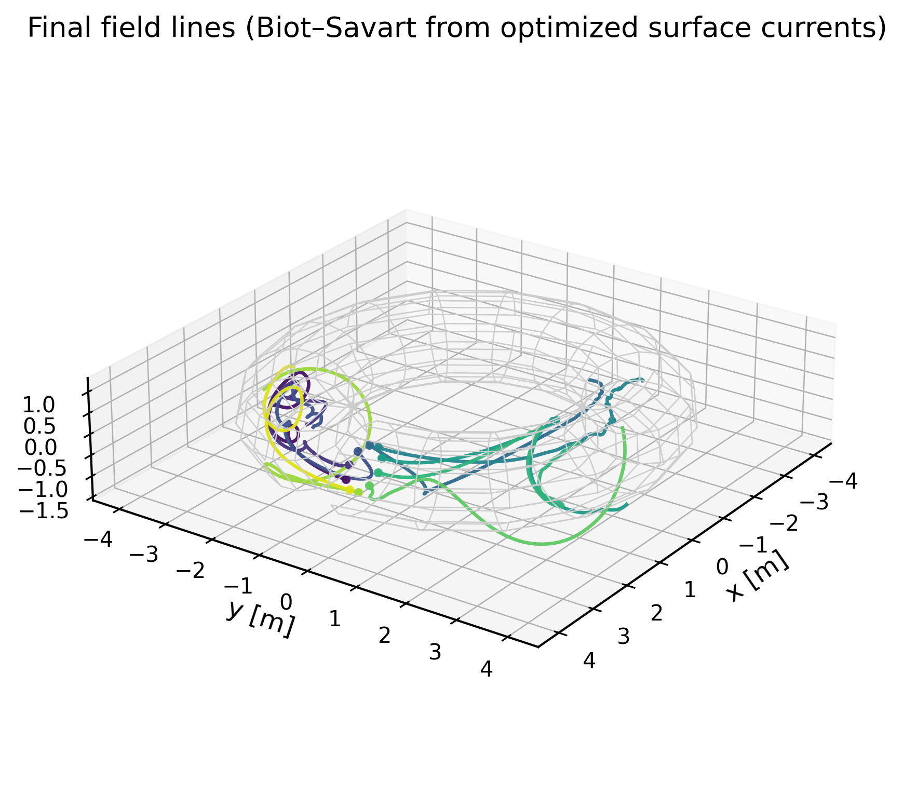
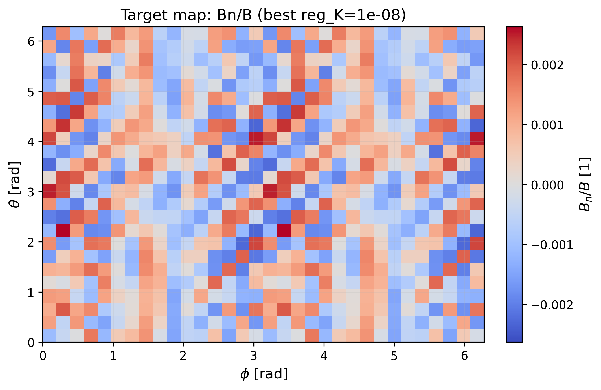
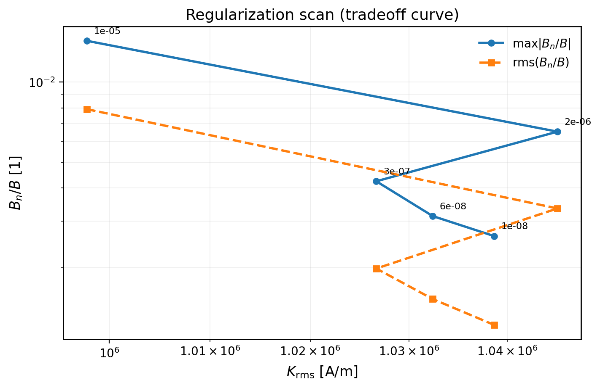
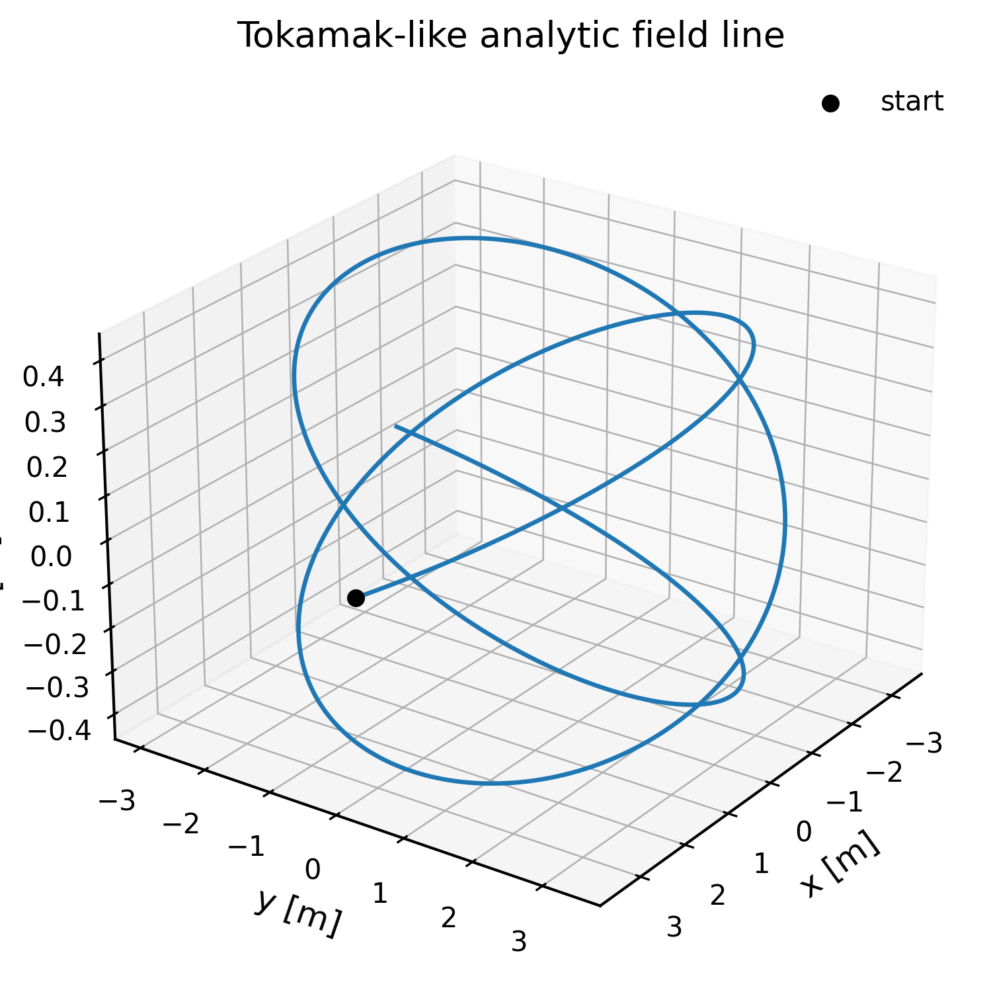

# torus-solver

JAX-differentiable **surface-current** modeling + **electrode optimization** on a **circular torus**.

The goal is to explore the idea:

> “Can we drive a controlled surface current on a conducting toroidal shell by placing a set of voltage sources/sinks on the surface, and then optimize those electrodes so the resulting magnetic field has stellarator-like structure?”

This repository is a **minimal, differentiable prototype**:
it is **not** a full replacement for REGCOIL / VMEC / pyQSC,
but it is designed to plug into that workflow later.

## Folder layout

This project uses a standard `src/` layout:

```
torus_voltage_solver/
  pyproject.toml
  README.md
  docs/                      # Read the Docs / Sphinx documentation
  .readthedocs.yaml          # RTD build config
  .github/workflows/         # CI + PyPI publish workflows
  src/torus_solver/          # the installable package (only library code)
  tests/                     # pytest suite (validations + regressions)
  examples/                  # runnable scripts with lots of debug printing
  benchmarks/                # micro-benchmarks
```

## Quickstart

From the repo root (`torus_voltage_solver/`):

```bash
pytest -q
python examples/fieldline_tracing/tokamak_like_fieldlines.py
python examples/inverse_design/optimize_helical_axis_field.py --n-steps 50
python examples/inverse_design/scan_vmec_surface_regularization.py --vmec-input examples/data/vmec/input.QA_nfp2
```

## Gallery

<p align="center">
  
  
</p>
<p align="center">
  
  
</p>

## Install (editable)

In a normal environment:

```bash
pip install -e .
```

If your environment has **no network** during build isolation, use:

```bash
pip install -e . --no-build-isolation
```

If your Python environment blocks writes to site-packages, use a venv:

```bash
python -m venv .venv
source .venv/bin/activate
pip install -U pip setuptools wheel
pip install -e .
```

## The physical model (what the code implements)

### 1) Conducting surface + electrode sources/sinks

We model a thin conducting shell (the torus surface) with a scalar surface potential:

- Surface potential: `V(θ, φ)` [Volts]
- Surface conductivity: `σ_s` [Siemens] (or equivalently sheet resistance `R_s = 1/σ_s`)
- Surface current density (tangential vector field): `K(θ, φ)` [A/m]

We assume Ohm’s law on the surface:

`K = -σ_s ∇_s V`

where `∇_s` is the **surface gradient** (gradient projected onto the tangent plane).

Electrodes inject/extract current into/from the surface as a **source density**:

- `s(θ, φ)` [A/m²] such that `∬ s dA = Σ I_i`

Current continuity on the surface gives:

`∇_s · K = -s`

Combining:

`-σ_s ∇_s² V = s`

This is a Poisson equation on a curved surface (Laplace–Beltrami operator `∇_s²`).

**Net injected current must be ~0** for a steady solution on a closed surface:

`∬ s dA = 0`

The code enforces this by subtracting the area-mean of `s`.

**Gauge**: `V` is defined up to an additive constant (`V → V + C` leaves `K` unchanged),
so we fix the gauge by enforcing:

`⟨V⟩_A = 0`

### 2) Geometry: a circular torus surface

We parameterize the surface with poloidal angle `θ` and toroidal angle `φ`:

`r(θ, φ) = ((R0 + a cosθ) cosφ, (R0 + a cosθ) sinφ, a sinθ)`

with major radius `R0` and minor radius `a`.

Tangent vectors:

- `r_θ = ∂r/∂θ`
- `r_φ = ∂r/∂φ`

Metric coefficients:

- `E = r_θ · r_θ = a²`
- `F = r_θ · r_φ = 0`
- `G = r_φ · r_φ = (R0 + a cosθ)²`

Area element:

`dA = √g dθ dφ`, with `√g = |r_θ × r_φ| = a (R0 + a cosθ)`

### 3) Laplace–Beltrami on the circular torus

For this metric, the surface Laplacian (Laplace–Beltrami) becomes:

`∇_s² V = (1/(a² R)) ∂_θ (R ∂_θ V) + (1/R²) ∂²_φ V`

where `R(θ) = R0 + a cosθ`.

The surface gradient used to form `K` is:

`∇_s V = (V_θ/a²) r_θ + (V_φ/G) r_φ`

### 4) Magnetic field from the surface current (Biot–Savart)

Given a surface current density `K(r')`, the magnetic field at `x` is:

`B(x) = (μ0/(4π)) ∬ [ K(r') × (x - r') ] / |x - r'|³ dA'`

We discretize the integral with the grid’s area weights.
This is currently an `O(N_eval · N_grid)` direct sum (good for prototypes, not yet fast).

## Numerical methods

- **Spectral derivatives**: `θ` and `φ` derivatives computed using FFTs (`jax.numpy.fft`).
- **Poisson solve**: since `R(θ)` varies, the operator is not diagonal in Fourier space.
  We solve `A(V) = b` using Conjugate Gradient (`jax.scipy.sparse.linalg.cg`), where:
  - `A(V) = -∇_s² V + ⟨V⟩_A` (SPD with gauge-fixing)
  - `b = s - ⟨s⟩_A`
- **Electrode deposition**: each electrode is a periodic Gaussian bump in `(θ, φ)`,
  normalized so its total injected current is `I_i`.
- **Differentiability**: the whole pipeline is JAX-traceable and differentiable end-to-end
  (including through the CG solve).

## Code map (where things live)

Library code (only these files live under `src/`):

- Geometry + grids: `src/torus_solver/torus.py`
  - `make_torus_surface(...)` builds `r(θ,φ)`, tangents, and area weights.
- Spectral operators: `src/torus_solver/spectral.py`
  - `spectral_derivative`, `spectral_second_derivative`.
- Laplace–Beltrami + Poisson solve + `K` from `V`: `src/torus_solver/poisson.py`
  - `laplace_beltrami_torus`, `solve_current_potential`, `surface_current_from_potential`.
- Electrode/source deposition: `src/torus_solver/sources.py`
  - `deposit_current_sources(...)` (periodic Gaussian kernels, area-normalized).
- Biot–Savart: `src/torus_solver/biot_savart.py`
  - `biot_savart_surface(...)` (direct quadrature).
- Optimization pipeline: `src/torus_solver/optimize.py`
  - `forward_B(...)`, `optimize_sources(...)`.
- Analytic reference fields: `src/torus_solver/fields.py`
  - `ideal_toroidal_field`, `tokamak_like_field`.
- Field-line tracing: `src/torus_solver/fieldline.py`
  - `trace_field_line`, `trace_field_lines`.

## Optimization

We parameterize `N` electrodes by:

- positions: `θ_i`, `φ_i`
- currents: `I_i`

To enforce the “closed surface” constraint, we project currents to zero-mean:

`I_i ← I_i - mean(I)`

Forward model:

`(θ_i, φ_i, I_i) → s(θ, φ) → V(θ, φ) → K(θ, φ) → B(x_k)`

Objective (default):

`L = mean_k || (B(x_k) - B_target(x_k)) / B_scale ||² + λ ||I||²`

The optimizer uses **Optax Adam**.

## Field-line tracing

We trace magnetic field lines using the normalized ODE:

`dr/ds = b(r) = B(r)/|B(r)|`

This makes the step size approximately spatial arc-length.

Implementation:

- RK4 time stepping
- `jax.lax.scan` for the loop
- `jax.vmap` for tracing multiple initial points at once

## Validations (what the tests cover)

Run all validations with:

```bash
pytest
```

Highlights (see `tests/test_torus_solver.py`):

- Torus metric identities (`E=a²`, `F=0`, `G=R²`, `|r_θ×r_φ|=√g`)
- Laplace–Beltrami analytic check for a pure toroidal Fourier mode
- Poisson solve inverts `-∇_s²` (up to gauge)
- Biot–Savart matches the on-axis field of a single circular current loop
- Analytic **1/R** fields:
  - ideal toroidal field `Bφ = B0 R0/R`
  - tokamak-like field `B = Btor0 R0/R eφ + Bpol0 R0/R eθ`
- Field-line tracing sanity:
  - pure toroidal field gives a circular toroidal line (constant `R`, `Z`)
  - tokamak-like field produces poloidal motion
- A “shell toroidal field” check:
  a uniform poloidal surface current sheet produces a toroidal `~1/R` field
  within a few percent on a modest-resolution grid
- Additional physics validations (see `tests/test_validation_physics.py`):
  - Ampère-law check for net poloidal current: `Bφ(R) ≈ μ0 Ipol/(2πR)`
  - scaling check: for fixed `Ipol`, `Bφ(R0) ∝ 1/R0`
  - resolution convergence: `max|Bn/B|` decreases as winding-surface resolution increases
- Sensitivity / differentiability checks (see `tests/test_sensitivity_gradients.py`):
  - autodiff gradients match central finite differences on tiny problems
  - Poisson solve validated against an explicit matrix solve at small resolution

## Examples

All scripts print a lot of debug output by design and (by default) save a set of
publication-style figures to `figures/<example_name>/`. Each script accepts:

- `--outdir ...` to change where figures are written
- `--no-plots` to disable plotting (faster)
- `--no-paraview` to disable VTK XML exports for ParaView (`.vtu/.vtm`)

Most non-GUI scripts write a ParaView “scene” file:

- `figures/<example_name>/paraview/scene.vtm`

Open that file in ParaView to explore the configuration in 3D (winding surface, electrodes, field lines, etc).

Note: run outputs under `figures/` and `paraview/` are intentionally `.gitignore`'d and should not be committed.

From the repo root (`torus_voltage_solver/`):

- Interactive 3D GUIs (VTK):
  - Requires VTK: `pip install vtk` (or `pip install -e .[gui]` if you install extras)
  - First interaction compiles JAX and can take a moment; later updates should be fast.
  - Run:
    ```bash
    # Electrode-current GUI (click to add/move sources/sinks, slider sets current):
    python examples/gui/gui_torus_electrodes_interactive.py
    python examples/gui/gui_torus_demo_helical.py

    # Cut-voltage GUI (slider sets V_cut across a toroidal cut, driving poloidal current):
    python examples/gui/gui_torus_demo_inboard_cut.py
    ```
  - Electrode-current GUI key bindings (also shown in the GUI):
    - `a`: add source (next click on surface)
    - `z`: add sink (next click on surface)
    - `m`: move selected (next click on surface)
    - `d`: delete selected
    - `tab`: cycle selected electrode
    - `c`: cycle surface scalar (`|K|`, `V`, `s`, `Kθ`, `Kφ`)
    - `f`: toggle field lines
    - `b`: toggle external toroidal background field ($B_\\phi\\propto 1/R$) in field-line tracing
    - `p`: toggle external poloidal background field ($B_\\theta\\propto 1/R$) in field-line tracing
    - `[` / `]`: decrease/increase `Bext0` (toroidal background amplitude)
    - `,` / `.`: decrease/increase `Bpol0` (poloidal background amplitude)
    - `r`: recompute
    - `i` / `v`: type the selected electrode current
    - `E`: export ParaView scene to `paraview/gui_torus_electrodes_<timestamp>/scene.vtm`
    - `s`: save screenshot to `figures/gui_screenshots/`
  - Cut-voltage GUI key bindings:
    - `c`: cycle surface scalar (`|K|`, `V`, `s`, `Kθ`, `Kφ`)
    - `a` / `z` / `m`: add source / add sink / move selected (next click on surface)
    - `d`: delete selected
    - `tab`: cycle selected electrode
    - `f`: toggle field lines
    - `b`: toggle external toroidal background field ($B_\\phi\\propto 1/R$) in field-line tracing
    - `p`: toggle external poloidal background field ($B_\\theta\\propto 1/R$) in field-line tracing
    - `[` / `]`: decrease/increase `Bext0` (toroidal background amplitude)
    - `,` / `.`: decrease/increase `Bpol0` (poloidal background amplitude)
    - `r`: recompute
    - `v`: type `V_cut` (cut voltage)
    - `i`: type the selected electrode current (extra sources/sinks on top of the cut)
    - `E`: export ParaView scene to `paraview/gui_torus_cut_<timestamp>/scene.vtm`
    - `s`: save screenshot to `figures/gui_screenshots/`

- Helical on-axis target optimization:
  ```bash
  python examples/inverse_design/optimize_helical_axis_field.py --n-steps 200
  ```

- Electrode-driven “inboard cut” that produces a toroidal ~1/R field (non-GUI):
  ```bash
  python examples/fieldline_tracing/inboard_cut_toroidal_field.py --trace
  ```

- Rotating ellipse around a bumpy axis (toy near-axis target):
  ```bash
  python examples/inverse_design/optimize_bumpy_axis_rotating_ellipse.py --R0 3.0 --a 1.0 --n-steps 120
  ```

- VMEC-surface normal-field minimization (prototype REGCOIL-like objective):
  ```bash
  python examples/inverse_design/optimize_vmec_surface_Bn.py --model current-potential --vmec-input examples/data/vmec/input.QA_nfp2
  ```

- Interactive VMEC optimization GUI (electrodes on a circular torus, target VMEC surface):
  ```bash
  python examples/gui/gui_optimize_vmec_surface_Bn.py --vmec-input examples/data/vmec/input.QA_nfp2
  ```
  This GUI minimizes a p-norm objective of `(B·n)/|B|` on the target surface, and supports
  background toroidal/poloidal fields (for tracing) with `T`/`Y` and `[`/`]`, `,`/`.`.

- REGCOIL-style regularization scan (tradeoff / “L-curve”):
  ```bash
  python examples/inverse_design/scan_vmec_surface_regularization.py --vmec-input examples/data/vmec/input.QA_nfp2
  ```

- Trace field lines in an analytic tokamak-like field:
  ```bash
  python examples/fieldline_tracing/tokamak_like_fieldlines.py
  ```

- Trace field lines in an analytic toroidal field and validate Biot–Savart along the trace:
  ```bash
  python examples/fieldline_tracing/shell_toroidal_fieldlines.py
  ```

- JAX vs NumPy speed demo for Biot–Savart:
  ```bash
  python examples/performance/jax_vs_numpy_biot_savart_speed.py --n-eval 512 --repeat 20
  ```

- External ideal toroidal field (B ~ 1/R) field-line tracing:
  ```bash
  python examples/fieldline_tracing/external_toroidal_fieldlines.py
  ```

## Benchmarks

From the repo root (`torus_voltage_solver/`):

```bash
python benchmarks/bench_forward_and_grad.py
python benchmarks/bench_fieldline.py
```

## Documentation

Docs are written for Read the Docs in `docs/` (Sphinx + MyST Markdown).

Build locally:

```bash
pip install -e '.[docs]'
python -m sphinx -b html docs docs/_build/html -W
```

## Roadmap / next steps

This is intentionally the “smallest differentiable thing that works”.
Natural extensions (many align with REGCOIL + pyQSC workflows):

- Replace the circular torus with a **general winding surface** (Fourier surface).
- Use pyQSC / near-axis expansions to define a target quasisymmetric configuration more faithfully.
- Add regularization terms that mirror coil design practice (power, curvature, smoothness).
- Speed up Biot–Savart (treecode/FMM, FFT-based convolution in special cases, or batching strategies).
- Add coil extraction (contours of a current potential) once the “shell current” design is satisfactory.
